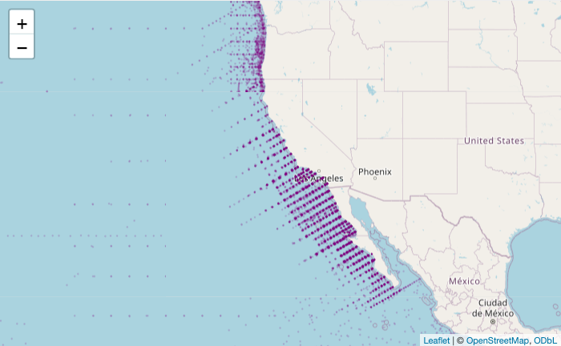

# leaftiles

This R package contains functions for adding layers to an R
[leaflet](https://rstudio.github.io/leaflet/) map from vector tiles
using
[Leaflet.VectorGrid](https://leaflet.github.io/Leaflet.VectorGrid/vectorgrid-api-docs.html).

Later, COGs.

## Vector Tiles

``` r
library(leaftiles)
library(leaflet)

leaflet() |>
  addTiles() |>
  setView(-122.4, 33.8, 4) |>
  addVectorTiles(
    server  = "https://tile.calcofi.io",
    layer   = "public.stations",
    layerId = "stationid")
```

<!-- -->
